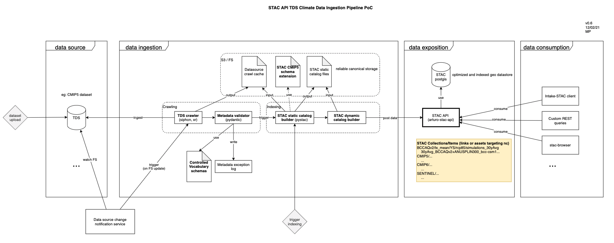

# STAC API TDS Climate Data Ingestion PoC

## High level pipeline view



This current project shows a PoC of the different parts of the ingestion process.


## Requirements

- STAC API running at `STAC_HOST` (see `.env.example`)
- THREDDS catalog at `THREDDS_CATALOG` (see `.env.example`)


## Demo

```
[setup .env file]

python3 -m main_ingestion_svc                       # Populate STAC API with TDS data
curl -s 0.0.0.0:8000/collections | jq -r '.[].id'   # Print all STAC collections that our local STAC API contains
curl -s 0.0.0.0:8000/collections/{collection_id}/items | jq -r '.features[].id'   # Print all STAC items that one local STAC API collection contains
python3 -m stac_api_data_eraser                     # Remove all data from STAC API
```


## Other useful stuff


### Validate schema

```
pip install stac-validator
stac_validator ./test_item.json --custom ./schemas/item.json 
```


### Run STAC-browser

```
# requires http-server, only to allow CORS, for dev
http-server -p 8000 --cors
CATALOG_URL=http://localhost:8000/catalog.json npm start -- --open
```