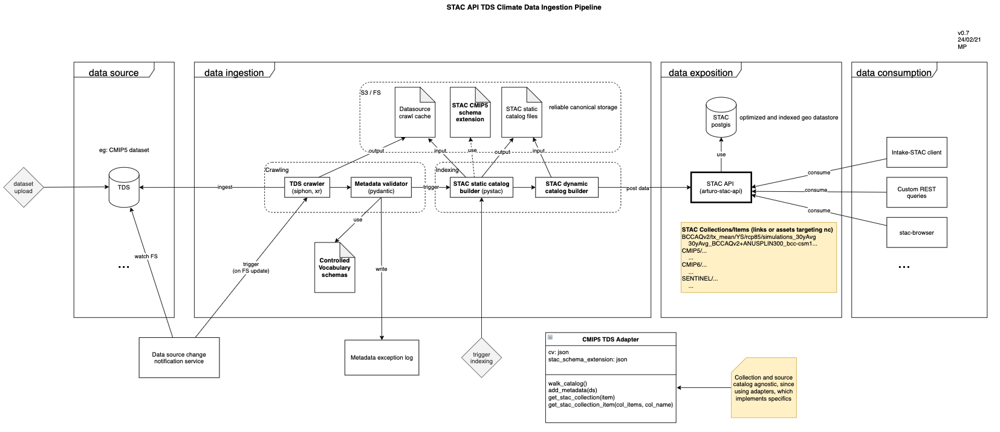

# STAC API TDS Climate Data Ingestion Pipeline PoC

This project shows a PoC of the different parts of the ingestion process.

## High level pipeline view




## Dependencies

Required
- STAC API running at `STAC_HOST` (see `.env.example`)
- THREDDS catalog at `THREDDS_CATALOG` (see `.env.example`)

Optional
- `stac-browser` git project cloned, to visualize static STAC catalog
    - In another terminal, to allow CORS, for development purpose:
        `mkdir output; cd output; http-server -p 8099 --cors`
 

## Demo

```
# Setup
[setup .env file]
pip install -r requirements.txt

# Crawl
python3 -m main_ingestion_svc                       # Populate STAC API with TDS data

# Query
curl -s 0.0.0.0:8000/collections | jq -r '.[].id'                                 # Print all STAC collections that our local STAC API contains
curl -s 0.0.0.0:8000/collections/{collection_id}/items | jq -r '.features[].id'   # Print all STAC items that one local STAC API collection contains

# Visualize
cd [stac-browser repo]
CATALOG_URL=http://localhost:8099/catalog.json npm start -- --open      # navigate the static STAC catalog 

# Clean
python3 -m stac_api_data_eraser                     # Remove all data from STAC API
```


## Other useful stuff


### Schema validation

```
pip install stac-validator
stac_validator ./test_item.json --custom ./schemas/item.json 
```
